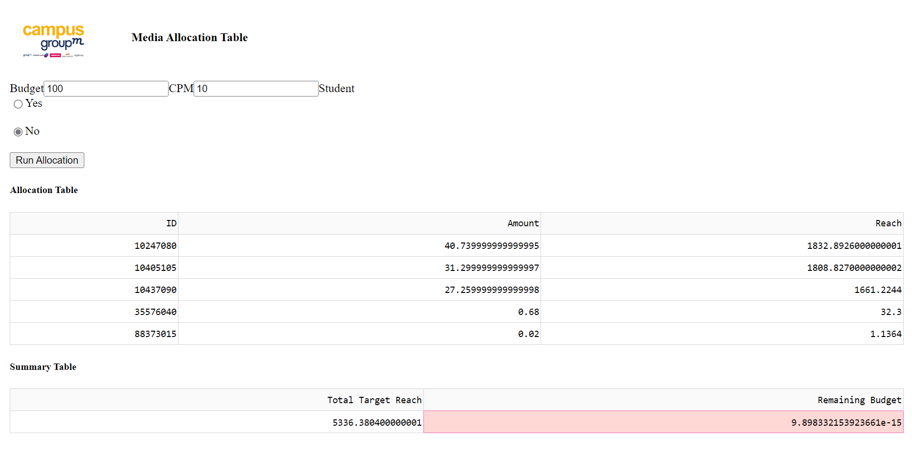

# Geo Marketing Planning App
## Description
This project contains 3 python scripts. <br>
1. A script which preprocesses data and does feature engineering<br>
2. A script which gets a budget, CPM (cost per 1000 reach) and other values and allocates them to a method. This method sets a thershold of maximum reach for budget and sorts regions from highest to lowest concentration. Then it runs a loop in which budget is being allocated to each region to maximize the reach <br>
3. A script which creates UI and callout functions of dash application, gets an input from user and returns two datasets with ID to and amount of money to allocate. And maximum reach <br> <br>

If you have this link, this means you are allowed to clone this repository to your machine and run an app. Make sure to open a folder since the modules are being imported through folder <br>
## Benchmarking of methods. 
This method here shows better results because it optimizes the reach based on the concentration of target population. To prove it we use a random dataset shuffling with the same calculations.  <br>
```
(self.df_filtered = self.df[self.df['within_reach']].sort_values(by='estimated_target_population', ascending=False))
```
<br>
So instead of this we use 
<br>
```
self.df_filtered = self.df[self.df['within_reach']].sample(frac=1).reset_index(drop=True)
```
<br>
This test was done in private jupyter notebook. Demonstration is available upon request.
<br>
